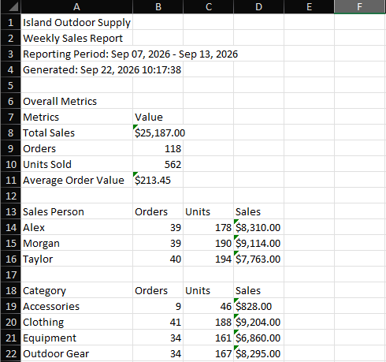

# Automated Weekly Sales Report
A Python automation that combines weekly sales spreadsheets, cleans and validates the data, identifies exceptions and duplicate orders, calculates sales metrics, and generates a management-ready Excel report.

## Business Problem
**Island Outdoor Supply** is a fictional small business that receives weekly sales spreadsheets from three sales representatives.
Preparing the weekly management report requires manually:
* Combining multiple Excel files
* Cleaning inconsistent data
* Checking for invalid records
* Identifying duplicate orders
* Calculating sales amounts
* Summarizing sales by representative and category
* Preparing the final report
This project demonstrates how that repetitive workflow can be automated with a small, maintainable Python application.

## Solution
The automation processes all Excel files in an input directory and:
1. Reads and combines the sales files.
2. Identifies the sales representative from each filename.
3. Normalizes dates and text fields.
4. Validates required fields and business rules.
5. Identifies and removes duplicate Order IDs.
6. Records excluded records and the reason for exclusion.
7. Calculates sales amounts.
8. Generates summary metrics.
9. Produces a formatted Excel report.

**Workflow**
```
Excel Files
 │
 ▼
Read & Combine
 │
 ▼
Normalize Data
 │
 ▼
Validate Records
 │
 ▼
Handle Exceptions & Duplicates
 │
 ▼
Calculate Sales
 │
 ▼
Generate Summary
 │
 ▼
Excel Management Report

```

## Sample Data
The project includes three fictional sales files:
```
data/
└── sample/
├── Sales_Alex.xlsx
├── Sales_Morgan.xlsx
└── Sales_Taylor.xlsx

```
The sample data intentionally includes several data-quality issues to demonstrate the validation and exception-handling capabilities of the automation:
* Inconsistent date formats
* Inconsistent category capitalization
* Leading/trailing whitespace
* Missing Quantity
* Invalid Unit Price
* Duplicate Order ID
No real customer or business data is used.

## Sample Results
The included sample data contains:

| Processing Result| Count |
| ------------------------------ | ----- |
| Source records | 121 |
| Duplicate records removed| 1 |
| Other invalid records excluded | 2 |
| Valid records| 118 |

These values are calculated by the application rather than hard-coded into the report.

## Generated Report
The application generates:
```
Weekly_Sales_Report.xlsx

```
The report contains four worksheets.

**Summary**
Provides:
* Reporting period
* Total sales
* Number of valid orders
* Units sold
* Average order value
* Sales by representative
* Sales by category

**Cleaned Data**
Contains the validated transaction data with standardized fields and calculated Sales Amount.

**Exceptions**
Documents records excluded from the final dataset, including:
* Source file
* Source row
* Order ID
* Issue
* Action taken

**Processing Log**
Provides file-level processing information, including:
* Records read 
* Valid records
* Exceptions
* Duplicate records

## Example Output
For example:


A screenshot of the generated report helps demonstrate the business-facing result of the automation without requiring someone to run the project first.

## Technologies
* **Python**
* **pandas** — data processing and analysis
* **openpyxl** — Excel workbook handling
* **pytest** — automated testing
* **pathlib / standard library** — file and application utilities

## Project Structure
```
automated-weekly-sales-report/
│
├── data/
│ └── sample/
│ ├── Sales_Alex.xlsx
│ ├── Sales_Morgan.xlsx
│ └── Sales_Taylor.xlsx
│
├── images/
│ ├── weekly-sales-summary.png
│
├── src/
│ ├── config.py
│ ├── main.py
│ └── __init__.py
│
├── tests/
│ ├── test_main.py
│ └── __init__.py
│
├── README.md
├── requirements.txt
└── .gitignore

```

## Installation
Clone the repository and install the required Python packages:
```
pip install -r requirements.txt

```
Using a virtual environment is recommended:
```
python -m venv .venv

```
Activate the environment and then install the requirements.

## Usage
The application accepts an input directory containing Excel files and an output path for the generated report.
```
python src/main.py -i /path/to/input/folder -o /path/to/output/Weekly_Sales_Report.xlsx

```
For example, using the included sample data:
```
python src/main.py -i data/sample -o output/Weekly_Sales_Report.xlsx

```
The output directory does not need to contain any input files. The application reads the .xlsx files from the specified input directory and creates the requested report.

## Data Validation
The automation applies the following business rules:
**Required fields**
Each input file must contain:
* Date
* Order ID
* Customer
* Product
* Category
* Quantity
* Unit Price

**Quantity**
Quantity must be greater than zero.

**Unit Price**
Unit Price must be greater than zero.

**Dates**
Supported date formats are normalized into a consistent format.

**Text fields**
Leading and trailing whitespace is removed from applicable text fields.

**Categories**
Category values are standardized for consistent reporting.

**Duplicate Orders**
Order ID is treated as the unique order identifier.
If an Order ID occurs more than once, the first occurrence is retained and subsequent occurrences are recorded as duplicates and excluded from the final dataset.

## Error Handling
The application provides clear errors for common input problems, including:
* No Excel files found in the input directory
* Missing required columns
* Unreadable input workbooks
* Unexpected processing errors
Processing activity is also recorded in a log file.

## Testing
The project includes automated tests using pytest.
Run the test suite with:
```
pytest

```
The tests cover areas including:
* Customer normalization
* Product normalization
* Category normalization
* Date normalization
* Quantity validation
* Unit price validation
* Missing-field validation
* Required-column detection
* Sales amount calculation
* Sales representative extraction
* Input-file handling

## Design Goals
This project intentionally focuses on a **small, well-defined business workflow** rather than attempting to build an enterprise-scale automation platform.
The implementation prioritizes:
* Clear business rules
* Predictable processing
* Explicit validation
* Traceable exceptions
* Maintainable Python code
* A useful business-facing output
Additional integrations such as databases, APIs, cloud services, scheduling, email delivery, and business intelligence platforms are outside the scope of this project.

## Portfolio Context
This is an independent portfolio project using fictional company information and synthetic data.
It demonstrates a typical approach to business automation:
**Understand the manual process → define the rules → build the automation → validate the results → deliver a usable output.**
The same approach can be applied to many repetitive spreadsheet and business-data workflows.

## License
This project is provided for portfolio and demonstration purposes.
